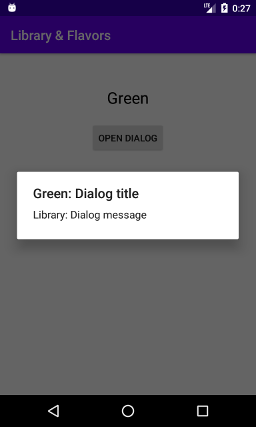

# Library & Flavors

This project demonstrates how you can use Localazy to translate your app with different flavors together with library module. 

See the [simple library integration](https://github.com/localazy/android-demos/tree/master/simple-library) here on Github to learn how to integrate Localazy with your library. For product flavors, nothing special is necessary. The process is exactly the same. 

In the description of the project linked above, you can learn that Localazy doesn't upload all strings - it omits strings that are overridden in all cases. The very same mechanism also applies for product flavors - automatically ;-).

There is just a small difference. The main strings and the library strings not overridden in main are uploaded too. Why? Because when you add a new flavor, you may not override it, and thus the fallback is necessary. 

In the screenshot below, you can see that `App: Dialog title` is present. Technically, it's unused, but it may be required under certain circumstances.  

---

**And the result?**

Without Localazy: 

 

With Localazy (The `[LL]` prefix is added by the `addPrefix` option and allows for verification that OTA updates are integrated correctly):

   

As you can see, everything is translated correctly even with OTA updates - with no single change to your source codes! 
